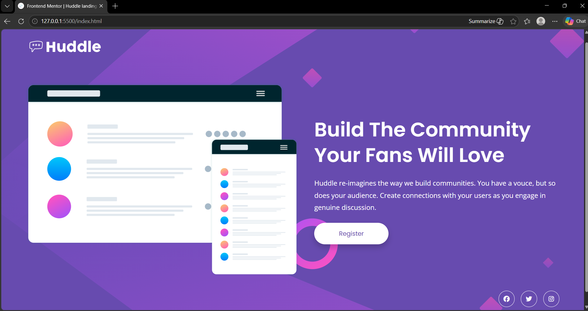

# Frontend Mentor - Huddle Landing Page With A Single Introductory Section Solution

This is my solution to the [Huddle landing page with a single introductory section challenge](https://www.frontendmentor.io/challenges/huddle-landing-page-with-a-single-introductory-section-B_2Wvxgi0) on Frontend Mentor. This project helped me practice responsive web design using HTML and CSS while recreating a modern landing page UI.

---

## Table of Contents

- [Overview](#overview)
  - [The Challenge](#the-challenge)
  - [Screenshot](#screenshot)
  - [Links](#links)
- [My Process](#my-process)
  - [Built With](#built-with)
  - [What I Learned](#what-i-learned)
  - [Continued Development](#continued-development)
  - [Useful Resources](#useful-resources)
  - [AI Collaboration](#ai-collaboration)
- [Author](#author)
- [Acknowledgments](#acknowledgments)

---

## Overview

### The Challenge

Users should be able to:

- View the optimal layout for the page depending on their device's screen size
- See hover states for all interactive elements on the page

---

### Screenshot



---

### Links

- Solution URL: https://github.com/Sasi-2006/Huddle-landing-page-with-a-single-introductory-section
- Live Site URL:  https://sasi-2006.github.io/Huddle-landing-page-with-a-single-introductory-section/

---

## My Process

### Built With

- Semantic HTML5 markup
- CSS custom properties
- Flexbox
- Responsive web design
- Media queries
- Mobile-first workflow
- Google Fonts
- Font Awesome Icons

---

### What I Learned

While building this project, I improved my understanding of:

- Creating responsive layouts using Flexbox
- Using media queries for mobile responsiveness
- Background image positioning and scaling
- Button and icon hover effects
- Structuring clean and reusable CSS

Example of responsive Flexbox layout:

```css
.hero{
    display:flex;
    justify-content:space-between;
    align-items:center;
    gap:4rem;
}
```

Example of responsive media query:

```css
@media(max-width:900px){

    .hero{
        flex-direction:column;
        text-align:center;
    }
}
```

---

### Continued Development

In future projects, I want to continue improving:

- Advanced responsive layouts
- CSS animations and transitions
- Accessibility best practices
- Writing cleaner and more scalable CSS
- Improving UI consistency across devices

---

### Useful Resources

- [Frontend Mentor](https://www.frontendmentor.io/) - Provided the challenge and design files.
- [MDN Web Docs](https://developer.mozilla.org/) - Helped me understand CSS properties and responsive design concepts.
- [Google Fonts](https://fonts.google.com/) - Used for typography styling.
- [Font Awesome](https://fontawesome.com/) - Used for social media icons.

---

### AI Collaboration

I used ChatGPT during this project to:

- Improve responsive CSS styling
- Debug layout and alignment issues
- Optimize media queries
- Get suggestions for hover effects and spacing
- Create a professional README structure

This helped me better understand responsive web design and improve the overall quality of the project.

---

## Author
- GitHub - https://github.com/Sasi-2006

---

## Acknowledgments

Thanks to Frontend Mentor for providing realistic frontend challenges that help improve practical web development skills.
